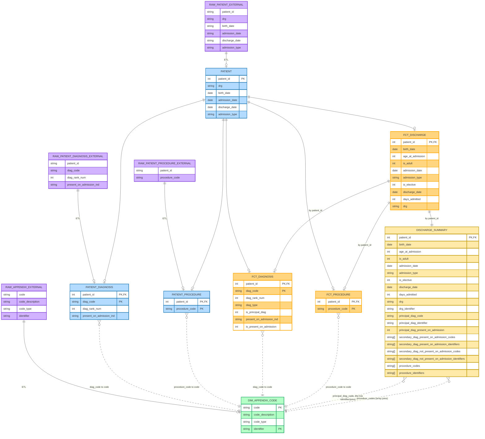

# hca-consulting-data-engineer-takehome
## Part 1 – Database Schema

### Assumptions

The following assumptions were made in order to design a relational schema consistent with the provided datasets and the scope of the take-home exercise:

- **`patient_id` is treated as equivalent to an encounter identifier.**  
  Each `patient_id` represents a single hospital encounter (admission/discharge)

- **The patient dataset contains exactly one row per encounter.**  
  No duplicate `patient_id` values are expected in the patient dataset.

- **Diagnosis and procedure datasets reference encounters only via `patient_id`.**  
  These datasets do not include additional visit-level identifiers (ex. admission timestamps, visit numbers, etc).
  
- **All diagnoses and procedures are assumed to belong to the same encounter represented by `patient_id`.**  
  Diagnosis and procedure tables are modeled as child entities of the patient record.

  ### Entity Relationship Diagram (ERD)

