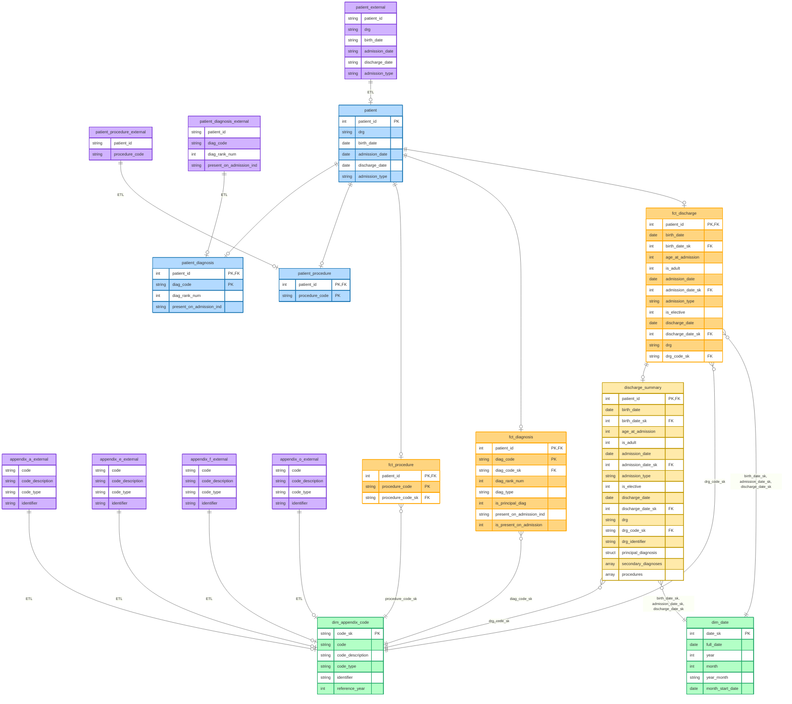

# hca-consulting-data-engineer-takehome

## Technologies Used

- **Google Cloud Platform (GCP)** – Cloud-native infrastructure supporting scalable analytics and data processing.
- **Google Cloud Storage (GCS)** – Storage layer for raw CSV source files, accessed via schema-on-read external tables.
- **BigQuery** – Primary analytical data warehouse used for ingestion, transformation, and analytics, including external tables, native fact and dimension tables, and scripted SQL for parameterized analytics.
- **GoogleSQL (BigQuery SQL dialect)** – Used for all DDL, DML, transformations, and analytics logic, including relational modeling, deterministic surrogate key generation, and complex aggregations.
- **Layered Data Architecture** – Raw → Core → Analytics design to separate ingestion, canonical modeling, and consumption-ready outputs.
- **Design-Only Orchestration & Testing** – Idempotent SQL patterns and assertion-based data quality checks designed to integrate with GCP-native schedulers (e.g., Cloud Composer).

## Part 1 – Database Schema

### Assumptions

The following assumptions were made in order to design a relational schema consistent with the provided datasets and the scope of the take-home exercise:

- **`patient_id` is treated as equivalent to an encounter identifier.**  
  Each `patient_id` represents a single hospital encounter (admission/discharge)

- **The patient dataset contains exactly one row per encounter.**  
  No duplicate `patient_id` values are expected in the patient dataset.

- **Diagnosis and procedure datasets reference encounters only via `patient_id`.**  
  These datasets do not include additional visit-level identifiers (ex. admission timestamps, visit numbers, etc).
  
- **All diagnoses and procedures are assumed to belong to the same encounter represented by `patient_id`.**  
  Diagnosis and procedure tables are modeled as child entities of the patient record.

- **`reference_year` is hardcoded to 2025 in dim_appendix_codes and in the corresponding joins.**  
  The sample dataset provided is from 2025. The expectation is that the codes will update once a year on January 1st, will be appended to dim_appendix_codes with the corresponding year.

  ### Entity Relationship Diagram (ERD)

  
## Part 2 – PSI-13 monthly output (2025)

### Description

The analytics.psi13_monthly_metrics table is built via a scripted BigQuery SQL file using a parameterized list of PSI-13 sepsis diagnosis codes and produces month-level numerator, denominator, and rate metrics.

## Part 3 - Design Only Nightly ETL for a rolling 12-month window

Reference `etl_design.md`